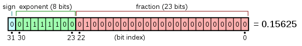

% Computer Arithmetics and Round-off Methods

[Back](index.md)

A computer performs basic operations through *finite arithmetic*:

* Only integer and rational numbers can be exactly represented.
* The elements of the set in which arithmetic is performed is necessarily finite.
* Any arithmetic operation between two or more numbers of this set should be another element of the set.
* Non-representable numbers like irrational numbers are approximated to the closest rational number within the defined set.
* Extremely large numbers produce overflows and extremely small numbers produce underflows, which are taken as null.
* Operations over non-representable numbers are not exact.

## Binary machine numbers

The implementation of a binary base is straightforward. Any other numeral system can be reduced to a binary representation.

### Single-precision numbers

Represented by **32-bits** (Binary digIT) lenght binary number, these numbers represent a real number stored, following the next rules:

1. The fist digit (called s) indicates the sign of the number (s=0 means a positive number, s=1 a negative one).
2. The next 8 bits represent the exponent of the number.
3. The last 23 bits represent the fractional part of the number.

We can follow the next formula in order to compute a given real number:

$$ r = \left(-1 \right)^s \times \left( 1+\sum_{i=1}^{23} b_{23-i}2^{-i} \right) \times 2^{e-127}, 
$$

where $s$ is the sing, $b_{23-i}$ the fraction bits, and $e$ is given by

$$ e = \sum_{i=0}^7b_{23+i}2^i 
$$

---
[Back](index.md)

